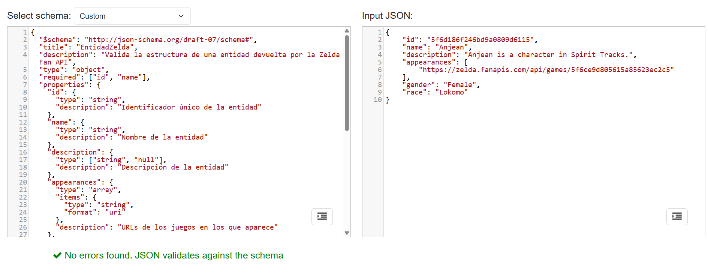
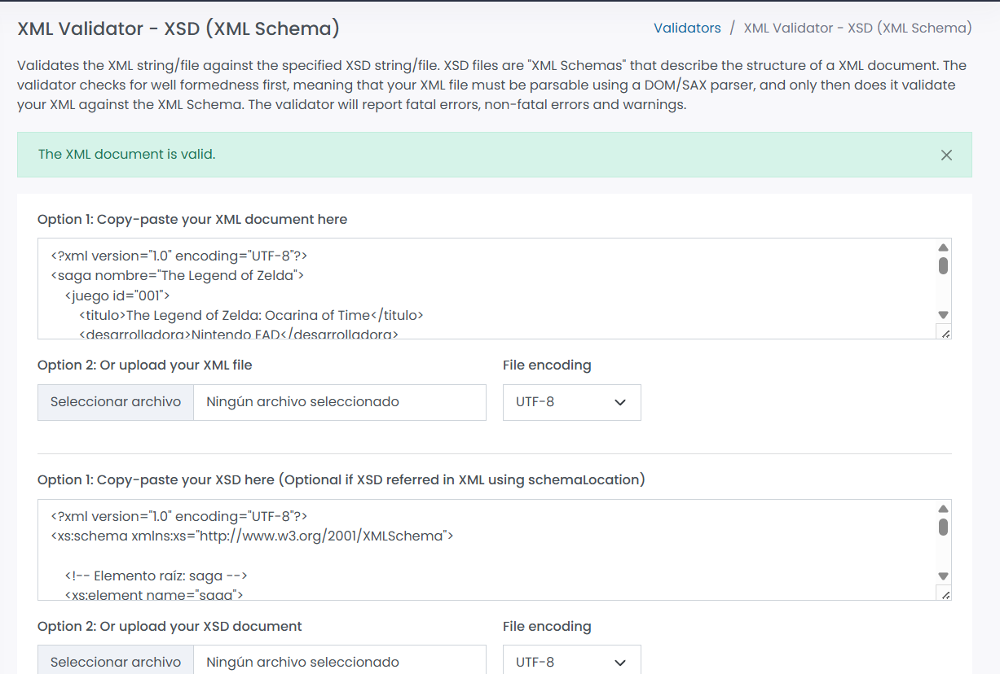

# Proyecto-Zelda-LMSGI

## Descripción del proyecto
Mi proyecto consiste en una enciclopedia interactiva basada en el universo de The Legend of Zelda. La aplicación permite a los usuarios buscar información detallada sobre personajes, monstruos, jefes y lugares de la saga. Además, incluye un sistema de favoritos para guardar datos y un catálogo de juegos basado en un sistema de archivos XML.

## Tecnologías y herramientas
- **HTML, CSS y JavaScript** — Es la base de toda la aplicacion, sin ningun framework.
- **Zelda Fan API** — Es la fuente de donde sacamos todos los datos de personajes, monstruos, jefes y lugares.
- **Firebase Firestore** — Base de datos en la nube que utilizo para que los favoritos del usuario no se borren.
- **localStorage** — Lo uso como "memoria rápida" del navegador para guardar las búsquedas recientes y no repetir peticiones a la API.
- **DOMParser** — Una herramienta de JavaScript que me permite leer el archivo XML del catálogo como si fuera una página web.

## La Zelda API
La url de la api es: https://zelda.fanapis.com/api

Antes de empezar a programar, estuve explorando los datos con Hoppscotch para entender cómo venía la información. Los apartados (endpoints) que utilizo son:
- /characters — personajes
- /monsters — monstruos
- /bosses — jefes
- /places — lugares

Aunque todos comparten datos básicos como el nombre o la descripción, he personalizado las tarjetas para que, por ejemplo, en los personajes aparezca la raza y en los lugares los habitantes.

Un pequeño problema que encontré: El buscador oficial de la API por nombre no funcionaba bien. Para solucionarlo, decidí traer 50 resultados de golpe y filtrarlos yo mismo con JavaScript, así la búsqueda es instantánea y no falla.

## Formatos de datos
- **JSON**: Es el formato que usa la API. Lo uso para toda la parte dinámica de la enciclopedia además es el más comodo para trabajar en JavaScript porque el navegador lo entiende directamente.
- **XML**: Es un formato basado en etiquetas. He simulado un "sistema antiguo" donde el catálogo de juegos está guardado en juegos.xml. Para leerlo, uso JavaScript para recorrer sus nodos.
- **CSV**: Es un formato de texto separado por comas, muy usado en hojas de cálculo. He añadido una función para exportar los datos del XML a un archivo .csv que se puede abrir en Excel.

## Esquemas
### JSON Schema (schemas/entidad_schema.json)
Valida que los objetos que devuelve la Zelda API tengan la estructura correcta. Los campos obligatorios son id y name porque sin ellos la aplicacion no puede funcionar

El resto de campos como description, appearances, gender o race son opcionales porque no todos los endpoints los incluyen.

Para validarlo use jsonschemavalidator.net
.

### XSD (data/juegos.xsd)
Es el esquema que valida mi archivo XML. Define que cada juego debe tener obligatoriamente un título, año, plataforma, etc., y que el año debe ser un número.

Para validarlo usé freeformatter.com pegando el XML y el XSD
.

## Almacenamiento
### Por qué localStorage para la cache
Cuando buscas algo, se guarda aquí. Si vuelves a buscar lo mismo, la web no le pregunta a la API, sino que lo saca de la memoria del navegador. Es mucho más rápido.

### Por qué Firestore para los favoritos
Como quería que los favoritos se mantuvieran aunque cerraras el navegador o cambiaras de ordenador, los guardo en la nube de Firebase.

### Limitaciones de localStorage
- Solo funciona en el navegador donde se guarda, no se comparte entre dispositivos.
- No tiene ninguna seguridad, cualquier script de la página puede leerlo.
- No permite hacer consultas complejas como ordenar o filtrar.

### Seguridad de Firestore
El proyecto usa Firestore en modo de prueba, lo que significa que cualquiera puede leer y escribir en la base de datos durante 30 dias. Esto es suficiente para mi proyecto pero en una aplicacion real habria que activar autenticacion de usuarios y añadir reglas para que cada usuario solo pueda ver y modificar sus propios favoritos.

### Otras alternativas de almacenamiento
- **sessionStorage** — Es igual que localStorage pero se borra al cerrar el navegador. Lo usaria para guardar datos temporales como un formulario.
- **IndexedDB** — Tiene almacenamiento local más potente, es util para grandes cantidades de datos. Lo usaria si la aplicación tuviera que guardar cientos de resultados localmente.
- **Supabase** — Es una alternativa a Firebase con base de datos SQL. Lo usaria si los datos tuvieran muchas relaciones entre sí y necesitara hacer consultas complejas tipo JOIN.

## Decisiones técnicas
### Separar la logica en modulos
Decidi dividir el codigo en cuatro archivos: api.js para las peticiones, firebase.js para la base de datos, transform.js para el XML y ui.js para lo que se ve en pantalla. Asi si hay un error en Firebase no afecta al buscador, y es mucho mas facil encontrar donde esta cada cosa.

### Debounce en el buscador
La busqueda se lanza sola mientras el usuario escribe. Además espera 400 milisegundos desde la ultima tecla pulsada antes de lanzar la busqueda, lo que reduce mucho el número de peticiones.

## Instrucciones de uso
1. Clonar el proyecto en tu ide favorito
2. Abrir el archivo index en el navegador
3. Es necesario tener conexión a internet para que funciones la api y la firebase